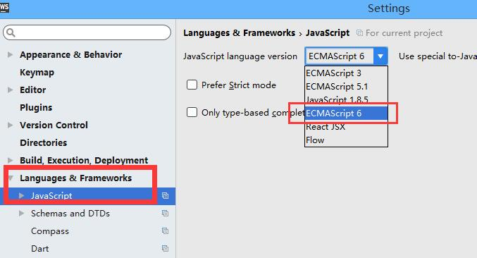
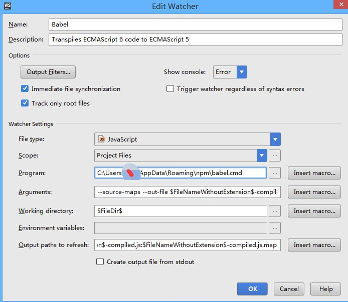
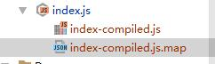

1.在项目的根目录下面创建 `package.json`文件。
输入以下内容：

```
  {
      "name": "project-name",
      "version": "1.0.0"
   }
```
2.打开WebStorm上面的命令行Terminal ，安装babel-cli（确保node已经安装）

```
npm install --save-dev babel-cli
```
3.如图所示，选择ECMAScript 6。



4. 如下图所示，设置Files Watchers。



```
Arguments设置:  --source-maps --out-file $FileNameWithoutExtension$-compiled.js --presets es2015 $FilePath$

Output paths to refresh 设置: $FileNameWithoutExtension$-compiled.js:$FileNameWithoutExtension$-compiled.js.map
```
5.在命令行中输入下面的命令：
```
npm install --save-dev babel-preset-es2015
```
6.在 根目录 下新建一个.babelrc文件，输入下面代码：
```
 {
     "presets": [
       "es2015"
     ]
   }
```
7.编译后的结果如下图所示：


