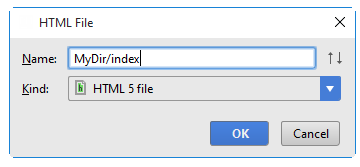

WebStorm提供模板文件对于大多数的语言支持。这允许您创建该文件的内容文件的适当的初始目的。例如，模板文件的HTML/XHTML/HTML5，XML，JavaScript文件、XSLT样式表文件和其它所支持的文件类型。

通常，模板文件扩展名的文件被自动设置，所以你不需要指定它。例如，如果创建一个JavaScript文件，.js扩展。新获得的HTML文件和XML.html和.xml扩展。新的XSLT样式表.xsl扩展。

创建一个新文件模板

通过以下方法之一：
在工程工具窗口在目录中，选择您想创建一个新文件，然后选择新文件|进入主菜单。
右键单击并选择对应的目录新从上下文菜单。
新闻ALT+INSERT
选择所需的文件类型。通常，所有的选项文件和目录对应于使用的模板文件。

现有模板的文件中可能缺少这种列表，如果是自定义模板，模板文件的扩展名（扩展名）不匹配登记的识别图案的任何类型的文件。在这种情况下，您可能需要注册的相应图案识别的现有的类型文件或添加新的文件类型和注册相应的图案，该新的类型。有关更多信息，请参见创建和注册文件类型。
在打开的对话框中，键入该文件的对应字段中。请注意,不应键入文件扩展名。
您可以指定整个目录结构添加新文件的名称。如果在嵌套的目录尚不存在，他们将被创建:

如果需要，指定了一种新的基于模板的文件。例如，如果您选择创建一个HTML文件，您就可以创建HTML，HTML4或XHTML文件。换句话说，使用一个对应的模板相关文件。

指定要求的其他信息。例如，可能要求您定义的自定义变量的值(如果对应这样的文件模板包含变量和值都不是当前设置。
点击OK。在新文件对应于所选择的模板文件将创建在该目标位置。
如果不存在该名称的子目录被指定在新文件中，整个结构将目录下创建目标：
有时，你可能想改变文件扩展名自动生成的。为此，可以使用重命名重构(重命名重构|)。
