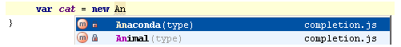
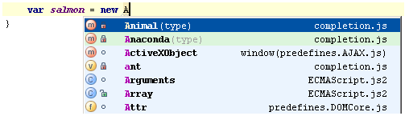
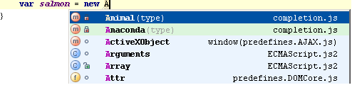

使用这个页面配置代码完成和参数提示设置。

**区分大小写完成**
从这个下拉列表中，选择您要WebStorm来暗示的代码完成比赛时，考虑到区分大小写的程度。可用的选项有：
所有：在查找列表仅包含所有输入字母的大小写相匹配的那些项目。此选项是最严格的。

无：在查找列表包含了所有的比赛，无论他们的理由。

第一个字母：该查找列表只包含的第一个字母匹配的项目。

自动插入时，只有一个选择上：
当本节中的复选框被选中，WebStorm不显示的情况下相应的完成型只有一个代码完成的变种是可用的，并且自动完成代码查找列表。
**排序查找项目按字典**

如果选中此复选框，在建议列表中的条目将根据他们的词汇排序。
如果未选中此复选框，在建议列表中的条目会按相关性排序。
注意，复选框定义的缺省行为。您可以通过点击更改它的任何时间a_icon或pi_icon图标的建议名单。具体请参考使用建议列表的详细信息。
