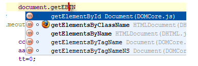

基础知识

任何活着或模板代码完成操作。建议列表您已选择所需选项。

WebStorm，提供实用的方式进行选择，完整的源代码，条目进行排序，并参考视图信息的建议列表。

浏览建议清单

建议浏览列表，用鼠标或光标向上和向下箭头键。

并建议列表

使用箭头键在所完成的水平表达以使建议更广泛列表(左箭头)或接近(右箭头)：

选择完成

使用进入插入所选字符串中的插入点。
使用选项卡替换字符串中的字符与所选择的一个。
使用Ctrl+Shift+Enter使当前代码构造(括号语法正确平衡，添加缺少的大括号和,分号，等等)。
可以手动输入所需元素名称时的输入位置和突出显示建议列表中被打开。在键入时,该建议列表匹配元件收缩，从而仅保留名称：

如果您输入名称不在使用范围、WebStorm，通知您的弹出窗口，如下图所示：

它可以是任何类型的字，即使对于位于中间的某个地方：

请注意以下事项：

如果调用行为，你无法得到你想要的，再通过调用该动作按下同一快捷键。
最适宜的变体的列表将被显示在列表的顶部。
粗体条目在列表的顶部，表示符号中定义的电流等级。所有其它的符号如下所示。

**查看信息列表中的参考建议**

使用快速定义视图。如果你选择的列表中的条目并按Ctrl+Shift+IWebStorm，快速显示下列信息弹出窗口：

快速查看信息作品在推荐列表中。如果你选择的列表中的条目，并按Ctrl+QWebStorm，快速显示下列信息弹出窗口：

在条目排序的建议列表

在条目排序的建议列表：

点击a_icon或pi_icon右下角的列表之间进行切换以字母顺序排序，或者通过关联。
请注意以下事项：

排序图标将出现在列表中，如果它足够长。只有很少的条目排序图标不被显示。
使用鼠标点击此图标。
WebStorm记录的排序类型。
默认行为中所定义，代码完成设置页面的编辑。
查看层次结构在弹出完成

在视图层次，以完成一个弹出式窗口，请执行下列步骤：

开始键入了源代码，并按Ctrl+Shift+Space或Ctrl+Space。该建议列表。
而在建议列表，请按Ctrl+H所述。层次工具窗口显示受类型层次类别，在选择建议列表。
关闭的建议名单

关闭的建议名单逃生然后，输入自己的代码的位置代码完成。
