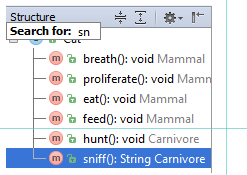

速度搜索在Windows的工具帮助你找到并导航到文件或文件夹项目工具窗口，在该一个构件结构工具窗口中的列表中版本控制工具窗口中的项目。Todo列表和其他内容。

注意，仅对搜索速度进行epanded节点，如果节点的匹配项被折叠在它未被检测到。

搜索工具窗口

1. 选择所需的工具窗口。
2. 开始键入项目的名称(例如，文件、类、字段等)。输入文本时，搜索场工具工具栏出现在窗口中显示输入字符，并且元件选择第一项目移动到与指定的字符串。部分匹配的字符串加亮。

3. 如果若干个相邻的项目，使用向上和向下键盘上的方向键来浏览。
4. 新闻进入当准备好。结果，匹配项目中选择工具窗口。按压逃生隐藏搜索场。