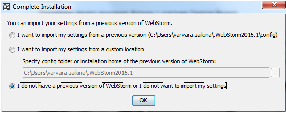

欢迎来到WebStorm！这个简短的指南旨在帮助你掌握的IDE。

请参考 [Guided Tour About WebStorm User Interface](http://www.jetbrains.com/help/webstorm/2016.2/guided-tour-around-webstorm-user-interface.html) 来了解WebStorm 界面风格的独特性。

* * * * *

**你开始之前**

你可以在安装WebStorm之后用正确的姿势开启工作。它提供了配置以及随时可用的本地开发环境，支持包括 Node.js, Meteor, AngularJS, CoffeeScript, TypeScript, Dart, Sass以及更多。

WebStorm 是跨平台的，在Windows、Mac OS X、和Linux上都可以运行。

* * * * *

**初始配置**

当你第一次启动 WebStorm，你会被询问是否使用以前的版本以及如何处理配置。出于教程考虑，假设不存在先前的版本，然后单击OK：

接下来，你将进入 WebStorm 许可激活对话框，你必须指定特定的许可：

您指定您的许可后， WebStorm  显示初始设置对话框。在这里有必须选择keymap以及你想使用的IDE和编辑的主题。单击向下箭头(单击显示预览)来预览你选择的看起来怎么样：

注意，WebStorm  有几个预定义的 keymap :为那些喜欢Eclipse或VisualStudio，Emacs粉、GNOME、KDE以及更多。在 Keymap 页面的  **Settings/Preferences**对话框探索可供使用的 keymaps列表 。

如果随后你觉得起初的选择是错误的，您也可以更改设置。了解更多关于keymap的配置，请参阅 Configuring Keyboard Shortcuts 部分。

你也可以改变IDE主题和编辑主题 后来。

还有一个ideavim插件用于提供webstormvi/vim/gvim仿真。请遵循这些指令安装它。

#### 从欢迎屏幕设置默认值

此外，如果这是你第一次打开(或者如果您没有打开的项目），你会看见 Welcome screen：

如果您单击 Configure 。WebStorm 会显示下拉列表，显示您设置 /偏好设置、插件，导入和导出设置，并检查更新。选择 Settings/Preferences ，参见 Settings/Preferences对话框，看这个对话框。——它Default Settings/Preferences.。

这意味着什么？这些设置将在您每创建一个新项目的时候都起作用。

有关默认项目的设置，都会有图标标记。

编辑设置适用于你的工作环境。

例如，您希望在编辑器中总是显示行号。在 Settings/Preferences 对话框中，展开  Editor ，在  Appearance 页面，选中复选框 Show line numbers：

假设您希望为编辑器使用某种特有的颜色方案，您不满意默认的建议颜色。好的，选择基础方案、创建或复制它，然后将颜色改变(默认方案不可编辑)。

您还可以设置偏爱的字体大小，这个操作是 Settings/Preferences 对话框 字体页Colors and Fonts 中。首先，您必须创建一个方案的副本，如果没有这样做，然后指定了期望的字体的大小。该字体大小将应用于当前编辑和最近打开的编辑。然而，这并不影响IDE组件的字体大小。

注意，你总可以在预览面板看到实验结果，:

* * * * *

#### 更改设置/首选项后
要改变项目中IDE的界面外观和编辑器的配色方案，你必须打开 Settings/Preferences(按 Ctrl+Alt+S或者在  main toolbar单击settings图标)。

例如，你想改变IDE的界面外观。注意，WebStorm  自带一些预定义的主题。主题设置取决于你的平台。你可以在 Settings/Preferences 对话框的  Appearance 页面你选择的主题。

这里展示了如何更改IDE的主题：
1. 在主工具栏上，单击settings或按 `Ctrl+Alt+S`。

2.展开 Appearance and Behavior，单击 Appearance。

3.在 Appearance页面，从下拉列表主题中选择你喜欢的主题：

注释对话框顶部的reset链接-如果你改变想法了，点击它回复到变化前的状态。还注意到当你鼠标指针点击按钮，按钮变为启用，：

你也可以改变 WebStorm的外观及其它设置，例如窗口的动作。
4.应用更改。您或许被建议重启IDE(例如，当您对 Darcula进行主题更换)。
OK，WebStorm 主题已经改变，但你仍不满意编辑器中代码的样式，而在代码编辑器中。例如，你想要用一种颜色高亮当前行。让我们配置它。

再次，在主工具栏上单击settings打开设置/首选项对话框中，展开之前编辑器，然后单击颜色和字体。
请注意，您不能更改您预先定义的颜色方案——你必须首先创建一个副本：

单击该按钮为救。..并且，输入你的新配色方案：

该新颜色方案被编辑，你就可以改变你的味觉。
下字体和颜色节点，单击一般在元件列表、扩展节点编辑器，找到符号行。
单击“背景颜色”片段与开放颜色选择器：

对了，你已经注意到，一些节点是标记current_project_icon还设置在这些页面中定义的当前项目。此图标的页面不包含有关设置整个工作环境。

L&F之差的主题与颜色方案编辑器
思维的差异IDE主题(外观和感觉)&编辑配色方案前者涉及整个IDE，后者则涉及仅在编辑器。很可能有一个黑色的主题（例如IDE、darcula)，和一个光的颜色格式的编辑器(例如，默认)。这样做，所有webstorm成分将在一个色彩方案，并且在编辑窗格中不同的一个：

工作项目

你在webstorm，你做的项目。

在webstorm，项目包含源代码和嵌套目录的名称.idea目录。.idea是webstorm存储所有必要的信息——不可见项目视图从用户角度来讲，一个项目只包含一些代码。

当创建新项目新项目文件|)，或者打开一个现有文件（打开文件|)、webstorm，建议你选择你想要打开的项目是：在新的窗口或同一窗口中打开先前关闭项目。

参见创建和管理项目的细节。

作为一个练习，创建新的空白项目，你可以开发一些纯代码。这种情况下做了详细教程创建并运行你的第一个Web项目。

通过该方式，提出了构建webstorm各种项目类型：空、TwitterBootstrap，HTML5样板等。你可以探索自己的可用类型，当创建一个新项目：
如您所见，webstorm支持所有的主流框架。用于每个支持的项目类型、webstorm创建对应的目录结构和文件，所有必要的构件。

与webstorm，您可以设置的项目如下：

打开您计算机上的目录中的源文件
克隆的版本控制储存库并创建一个项目的来源下载
从无到有启动一个项目
最后，当项目准备好，你可以创建新文件或目录，。

创建一个项目，从现有的资源
一旦你有了自己的应用在计算机本地源文件，可以创建一个新的项目：

点击打开在欢迎屏幕，或选择打开论文件菜单。
参见打开、重新打开和关闭项目

项目周围创建一个版本存储从控制源
你也可以下载源和从VCS存储器库，如GitHub。

选择从版本控制系统VCS|checkout|Vcs<你>)。当问及webstorm，键入您的证书存储。

参见以下章节：

VCS-具体程序
从GitHub库的克隆
设立一个本地的Git仓库
来自SVN储存库签出文件
从无到有启动一个项目
你可以开始你的项目开发中的应用。

欢迎点击屏幕创建新项目或者，在主菜单中，选择文件|新项目。..。
在打开的对话框中，选择所输入的项目类型和项目属性，诸如项目名、项目类型和父文件夹。
界定一个项目的项目类型，则可建立与外部(或模板生成器网站入门套件，TwitterBootstrap，Express，流星并且，多个)。
参见创建新的项目。

填入您的项目
添加新文件或目录到您的项目只有一个：选择文件|新。..从主菜单或新从上下文菜单工程工具窗口。

选择元件的选择，然后输入其名称。其余webstorm：创建与模板文件的源代码。

参见填充工程的细节。

一切为你定制方案！

看看主工具栏按钮的设置settings点击此按钮可打开的。设置/首选项对话框，您可以更改项目结构、版本的控制和调整自己的工作环境，从而使开发过程更舒畅。

一些设置涉及特定项目，例如，配置控制版本、文件或颜色。这些标志current_project_icon。其他的编辑设置、键、或生活模板——属于你的工作环境，因此，也可以构成没有开放的项目。

VCS
当然，你保持你的版本的控制下，对吗？Git吗？SVN？水银？与webstorm，设置简单，又很好的IDEAuto-VCS检测已经用于现有项目。

但您可以微调——只需单击版本控制在节点中设置/首选项对话框。默认情况下,您将看到项目根目录，但你可以打破您的应用程序分解为更小的块，并且将每一个目录下它自己的版本控制系统。

在设置/首选项”对话框中，您也可以定义哪些行为被共同用于所有的版本控制系统：在创建或删除文件确认，在后台执行任务，忽略未版本控制的文件和更多。

请参考章节版本控制与webstorm的细节。

本地历史
除了传统的版本控制系统，您可以使用本地历史与当地的历史、webstorm自动跟踪更改源代码、重构和源代码的状态是基于一组预定义的事件(测试、部署、提交或更新)。历史总是被启用。

文件颜色
您的项目可能含有多个位点，每一个具有其自己的文件具有相同的名称。在所有打开的编辑器，它是相当混乱的。..谁能说它们属于哪一个网站？webstorm让他们通过绘画编辑选项卡(设置/首选项文件行为|&|外观颜色)。

把你的方案分成小块：作用域(例如，每个站点的范围)，以及选择颜色。

见后页构成文件范围和颜色的细节。

IDE和编辑器
IDE装置在实际工作生活中，很自然让你的眼睛你的闹鬼地方令人愉快和舒适。这就是为什么webstorm能选择的外观和感觉的IDE和编辑器，那么优选的键盘快捷方式(键)，微调行为的滚动、高亮和更多。

建议与熟悉的部分项目和IDE设置和配置设置。

所有这些设置(再次)配置在与设置/首选项对话框：点击settings以打开此对话框并且，参照列表页。这里有三个页面可能感兴趣的起动器：外观，编辑器，和键位。

外观
记住，你最初选择的外观和感觉您的IDE的第一次启动？如果你对效果不满意，现在是时候改变了主意。在该页面外观（页设置/偏好行为外观外观|&|)您可以选择“外观和感觉”webstorm安装。仅需单击外观和感觉下拉菜单，并选择适合您的方案更好。你不需要关闭设置/首选项对话框来观察实验结果：点击应用，看看会发生什么，并关闭该对话框时是意义所在。

编辑器
整个页面根据编辑器节点的设置/首选项对话框的各个方面有助于调整编辑器的行为。注意，该预定颜色webstorm配备方案，但如果你想弥补一些非常个性化，你可以：默认的保存格式的新名称，并开始改变其背景、字体、颜色的句法elemeNTS，错误高亮，并立即进行观察的结果，在预览窗格。

请参阅第项目配置和设置IDE和webstorm编辑器。导游的细节。

键位
所述的键盘快捷方式和你一起工作是你最亲密的习惯--你的手指来“记住”特定组合的键、和改变这个习惯是相当痛苦。为此，webstorm您提供宽范围的预定义(键键位)，对于那些喜欢Eclipse，或为那些有长期经验的VisualStudio...您可以创建您自己的键。

最后，还有魔法快捷键CTRL+反引号帮助你开关之间的那些方案（keymaps、颜色、代码风格和L&F)没有设置对话框（Windows和Linux用户)。

参见键盘快捷键配置的细节。

外部编辑器
虽然你可以选择任何您喜欢的键位对应(emacs编辑器、VIM、textmate等），你可能还想要在您喜欢的编辑器打开文件。通过它你可以轻松地配置外部刀具。例如，您可能想打开的文件的emacs作为电流在外部工具。

参见第三方工具配置的细节。

背景任务

有时，当一个任务是在进步、webstorm显示一个进度条。你可以把这样的任务为背景，但仍看效果如何。参见页次背景与任务的细节。

使用宏

要是能有一个机会来简化您的工作与编辑。使用宏只是其中一种可能的方法。请参阅产品文档的细节。

使用多个文件

你可能已经注意到，webstorm打开每个文件在单独标签的编辑。

webstorm提供便捷的交通工具开关之间的各个选项卡允许，钉扎和解除每个选项卡编辑器标签放置，沿着四个边缘窗口，将编辑器标签以及更多。

参考文档章节管理编辑器标签的细节。

你度过

现在当你知道如何开始使用webstorm，看看它的导航特征。他们将帮助您不迷路，还将提高您的工作效率。

* * * * *
#### 无处不在的搜索
搜索是用来快速导航最常见的和必要的选项。使用 WebStorm 你可以搜索任何类别、文件、功能或甚至只使用一个动作进行IDE设置。：双击	`Shift`  或在WebStorm 窗口右上角：

**搜索项目元素**

工程元素概览的基本工具是工程窗口 (View | Tool Windows | Project tool window)。它用文件目录树显示你的项目。要使用它，点击工具栏的窗口图标或按 `Alt+1`：
要想通过名称元素快速查找并在编辑器中打开它，使用导航弹出：按` Ctrl+N`（一类），` Ctrl+Shift+N` （对于文件），或`Ctrl+Shift+Alt+N`（一个符号），并开始输入你正在寻找的名称。匹配名称列表随着你的键入收缩，这仅仅是方便的设施之一：您可以使用通配符星号，所有驼峰字符串，或者如 snake_case 有空格的名字，斜线嵌套的文件夹和等，等等。

**搜索代码元素**

浏览和搜索源代码的基本姿势是 `Ctrl+F`。开始键入你要搜索的字符串，就会在当前文件看到他的出现：

在当前文件搜索的终极方法是使用 文件结构视图（`Alt+7`或 `Ctrl+F12`），并通过它搜索：

除此之外，WebStorm建议一个更复杂的方法，即 搜索用法。例如，如果你想查找一个符号在应用程序中的用法，按下`Alt+F7`,或者在它的上下文菜单选择 **Find Usages**，并在  Find Tool Window 观察结果：

使用“转到”行动导航到声明（`Ctrl+B`），实现（`Ctrl+Alt+B`），类型声明（`Ctrl+Shift+B`），或超级方法	（Ctrl+U）。

请参考以下部分  Searching Through the Source Code 和 Navigating Through the Source Code 详细信息。

IDE组件
有 许多方法可以横跨在IDE导航。你可能不记得所有的动作和菜单命令周围的第一次，这是确定。别担心！你需要的任何IDE行动的任何时候，你可以发现它在帮助| 查找动作... （Ctrl+Shift+A）或使用到处搜索。所以，让我们简单介绍一下一些主要的命令。

让我们先从 切换：按Ctrl+Tab显示切换，这是WebStorm的工具窗口和打开文件，然后列表，保持 Ctrl键按下，使用Tab或箭头键滚动到你想去的组件：

按Ctrl+E看最近的文件列表。按下 Ctrl+Shift+E看到最近编辑过的人的名单。

如果您有多个IDE窗口打开，使用Ctrl+Alt+Open Bracket和 Ctrl+Alt+Close Bracket快捷键在它们之间切换。

如果您在IDE组件之一选择一个文件，并希望在另一个（编辑器，项目视图，导航栏，或变更）进行查看，然后使用 选择目标 （Alt+F1）：

最后，按Escape将带你回到编辑器，无论你在哪里， Ctrl+Shift+F12将隐藏所有的工具窗口，只留下编辑器。

智能辅助码

WebStorm是著名的智能代码分析功能。不管你做什么开发的源代码，它总是在手，帮助您创建没有浪费时间无差错的应用程序。

**编辑和书写代码**
在发展的每一个阶段，任何文件，尝试使用 代码完成 （Ctrl+Space），其中考虑到目前的情况下。根据你调用这个动作，就可以完成关键字或代码块，推断类型的，完整的方法和属性，以及更多：

请享用 live templates/code snippets （`Ctrl+J`）或 surround templates （`Ctrl+Alt+T`）来产生整个代码结构：

WebStorm配备了一系列准备使用的活动模板，或片段，您可以在探索 动态模板的页面 设置/首选项对话框。如果你看到你少了点什么特别重要，你的发展目标，扩展这套片段与自己的。

不要错过也完全代码结构环绕的可能性（选择 代码| 周围加上或按 `Ctrl+Alt+T`）。

WebStorm帮助你按照代码风格指南。所有的新代码是根据代码风格设置自动格式化（Settings/Preferences | Editor | Code Style）。不过你可能需要格式化的部分代码或应用在代码风格设置所做的更改。要做到这一点，使用  Code | Reformat Code...（`Ctrl+Alt+L`）。

心灵上的权利，你的代码标记栏。红色的彩色条纹表示错误，黄色条纹是警告，和蓝色的条纹代表待办事项。只需点击他们浏览到一个错误，警告或TODO注释。检查结果为当前的文件的摘要显示在顶部的颜色指示器。让它绿色的！
您可以使用赫克托图标赫克托的右下角配置检查，设置为您的文件高亮水平。
默认情况下，赫克托不夜城。

如果你确信你自己，把他关闭，你会得到警告没有，也没有提出改进建议或错误消息。

* * * * *

**分析代码**
我们是开发商，只花20％的时间我们编写新的代码，但高达80％，改善现有的代码。为了帮助您避免错误和更快的纠正，WebStorm给你以最好的开发实践无数的暗示和提示。

首先，当你键入，你马上有一个红色波浪下划线标出所有的语法错误。如果放置插入符的一个错误的位置，你会看到问题的简短描述的工具提示，以及在的左侧状态栏。除此之外，你看到沿着红色条纹 验证栏或标记栏。如果你将鼠标指针悬停在这样的条纹，你看到工具提示错误描述。

当你输入你的代码，WebStorm，像一双勤劳的程序员，不断目前你在做什么密切关注。此外，IDE提供了智能的建议，也被称为 意图的动作，这都标有intentionBulb或  quickfixBulb图标。点击这样的图标，或按Alt+Enter 自动创建您尚未宣布的新方法，解决一个if / else语句，以及更多：

下一级是静态代码分析，或 代码检查：你的代码，而无需实际执行它进行了分析。实际上，WebStorm检查在上即时当前文件代码，并示出了在标记栏作为彩色条纹的检测结果。如果你看到你的IDE框架的右侧是明亮的红色条纹，请注意-这意味着你的代码中包含严重的错误。不太重要的事情，建议，以改进代码，或警告，显示为黄色条纹。当前文件信息汇总在标记栏，它的工作原理交通灯顶部的彩色指示灯：绿色表示一切都很好; 至少一个问题接通指示器黄色或红色。

有时候你需要更深入了解你的代码。在这种情况下，你必须检查整个项目，或其任何部分（代码| 检查代码），并探讨在结果 检查工具窗口：

WebStorm配备了多种预定义的检查。个个都说明，并且可以打开或关闭在切换，或根据需要配置检查 设置/首选项对话框的页面：

为了帮助你做出你的源代码少纠结，更具可读性，WebStorm报价 寻找重复整个项目或它的一部分（代码| 找到重复...）。看看在检测到重复片段重复工具窗口，并决定做什么与他们。

详情请阅读章节 代码检查，意向行动 ，并分析应用。

查看文档
WebStorm使得可以查看现有文档，在插入符号的符号。有几种可能的方式做到这一点：
请参阅产品文档 查看参考信息。

**安全重构**
检查你的代码后，你可能有兴趣在由WebStorm提供的代码重构。该IDE可帮助您安全地重命名，提取方法，超类和模块，引入变量，常量，参数，等等。使用重构| 重构这个... （Ctrl+Shift+Alt+T）查看可用于当前的代码片段都重构。

* * * * *

**即时变化**

你可以在浏览器中打开HTML，JavaScript或CSS文件，并监视在编辑器中你做它的变化是如何无需刷新页面，甚至不留WebStorm呈现。顺便说一句，完成查询还活着。当您浏览的建议列表，在浏览器的页面改变其外观，就好像你已经接受了目前的建议。目前，实时编辑只在谷歌Chrome，Chrome Canary版和Dartium支持。

要使用实时编辑，请确保 JetBrains 的 **Chrome扩展程序** 已经安装在你的Chrome浏览器上。

如果Chrome浏览器不是第一个推出的IDE安装了实时编辑插件期间运行的浏览器扩展程序将会自动安装。谷歌Chrome扩展JetBrains的IDE支持是可用 [Chrome网上应用店](https://chrome.google.com/webstore/detail/jetbrains-ide-support/hmhgeddbohgjknpmjagkdomcpobmllji)。

对于实时编辑正常工作，你应该运行 JavaScript的调试会话 或Node.js的调试配置。为了启动一个JavaScript调试会话，运行/调试配置必须创建第一。这可以自动使用完成调试FILE_NAME上下文菜单，或手动，如果要指定其他选项。另外，通过选择在Chrome中打开该页面打开浏览器中从上下文菜单中 html的文件。当页面打开时，选择 在WebStorm检查从上下文菜单中。

您也可以刷新页面，查看更改不留WebStorm，只要选择 运行| 刷新浏览器中的主菜单上，当时的JavaScript调试会话处于活动状态。

详细信息参见 [HTML, CSS, and JavaScript 实时编辑](http://www.jetbrains.com/help/webstorm/2016.2/live-editing-of-html-css-and-javascript.html)。

* * * * *

**运行和调试应用程序**

没有运行配置所需的启动与WebStorm注入的JavaScript代码的应用程序。只需打开一个实现在编辑器应用程序的起始页面的HTML文件，然后选择查看| 打开浏览器主菜单上，选择所需的浏览器。

您的应用程序或脚本运行到一个运行时错误？要了解它的起源，你将不得不做一些调试。它以设置断点（只需单击您希望断点出现线的左侧装订线），在该程序执行将被中止，所以你可以探索的程序数据。

JavaScript调试在WebStorm通过JavaScript调试器捆绑的插件，它是默认启用的提供。在您开始调试， 配置调试器选项。

随着WebStorm，您可以调试在Firefox和谷歌的Chrome浏览器的JavaScript代码。调试是由特定的浏览器扩展JetBrains公司的支撑。从你的身边，不需要特殊的步骤来安装或启用这些扩展。WebStorm做它，当你启动调试会话首次为。

您可以手动启动调试会话，通过在WebStorm默认浏览器使用JavaScript注入打开一个HTML文件（确保它是Firefox或Chrome），或通过类型的调试配置 JavaScript的调试。

要开始调试，单击Debug按钮调试主工具栏，或按上 Shift+F9。
最后但并非最不重要的，你也可以 运行和调试应用程序的NodeJS。集成 Node.js的是由Node.js的插件，捆绑WebStorm并默认启用的提供。Node.js的运行只在本地模式的支持，调试可以在本地和远程。

本地调试是根据Node.js的调试配置执行，并且Node.js的服务器从WebStorm启动。在远程调试的情况下，WebStorm连接到一个已经运行的应用程序的Node.js。这种方法使您无需重新启动服务器的Node.js重新启动调试会话的可能性。远程调试是根据执行 Node.js的远程调试配置。

请参考以下部分 运行和调试的Node.js和 运行和调试的JavaScript。

* * * * *

**测试你的应用程序**

这是测试你的应用程序的好主意，	WebStorm 尽可能地帮助你。
WebStorm 通过捆绑并默认启用的 Karma 插件支持 [js应用单元测试](http://www.jetbrains.com/help/webstorm/2016.2/unit-testing-javascript.html) 。

JavaScript的单元测试都在反对，实际上处理测试过程中的测试服务器浏览器中运行。WebStorm有一个从IDE右推出了本地测试服务器。此服务器允许您捕捉浏览器中运行测试，加载测试目标，以捕获的浏览器，控制测试过程中，浏览器和WebStorm之间交换数据，这样你就可以查看测试结果，而不必离开IDE。任命于噶运行配置运行测试。明确指定测试或准备 配置文件 并在运行配置指定它们。

要运行测试，选择相关的配置，然后在工具栏上点击运行按钮，或者只是按 `Shift+F10`。

要测试代码覆盖率，选择相关配置，然后在主工具栏上单击覆盖率按钮。

查看 [测试](http://www.jetbrains.com/help/webstorm/2016.2/testing.html) 和 [JavaScript单元测试](http://www.jetbrains.com/help/webstorm/2016.2/unit-testing-javascript.html)。

* * * * *

**就这些了！**

在这里，我们对 WebStorm 的一些重要功能做了非常简洁的概述，只是为了你能够快速开始。有许多重要的功能可以使您的生活更轻松，让你的源代码变得友好和整洁。

享受 使用 WebStorm 开发的乐趣！