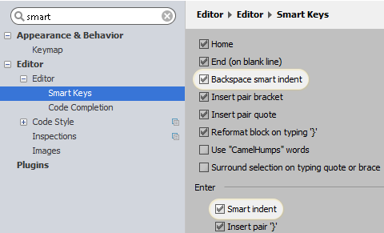
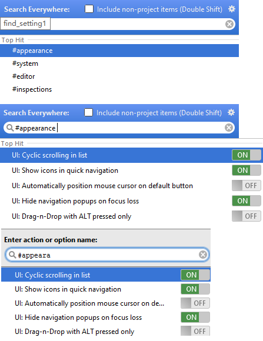

## 访问设置

### 打开设置/偏好对话框

执行下列操作：
* 按下 `Ctrl+Alt+S`
* 在工具栏上单击
* 在主菜单中，选择 `File | Settings`  （Windows或Linux ）或`WebStorm | Preferences` （OS X）
* 按下 `Ctrl + Shift + A` `settings` 再按下`Enter`，参加 Navigating to Action
* 在WebStorm窗口的右上角点击搜索，参见 Searching Everywhere 。

### 查找选项或设置
1. 打开设置/首选项对话框。
2. 在搜索区域中，输入您希望找到的设置名称的文字。一旦指定的文本被找到，匹配的元素就会高亮显示，相应的页面也会显示。

### 使用Search Everywhere或Find Action查找选项或设置
您还可以使用Search Everywhere或Find Action。要找到选项或设置，首先键入＃字符，然后选择建议的类别之一：

